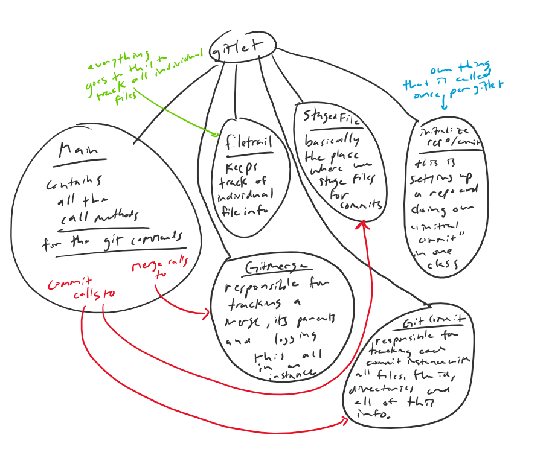

# Gitlet Design Document
author: Nishank Gite

## 1. Classes and Data Structures
**Main** -

defaultidlen = The default length of a commit id, which is 40.

currworkdir = our current working directory.

gitdirectory = Our .gitlet subdirectory in our current working directory.

origmastHEAD = The head reference file (like origin master).

committracker = Basically the file to track commits.

remotesubdir = Our remote directory within the subdirectory.

AllBlobs = File basically holding blobs.

currentbranchpos = Just the current branch you are in (should change accordingly).

allbranches = File that hold all the data on branches.

**GitCommit** - 

msg = The message for the commit.

time = Time of the commit.

hash = Hash of the commit id.

dir = Directory of which to push the commit into.

stgarea = The place where we stage all commits.

br = The corresponding branch of the commit.

parent = The parent of this commit.

**GitMerge** - 

parentid  = the id of the parent found after merging.

**FileTrail** -

file = File we are now changing to become the basic git unit of blob.

hash = Our blob hashcode.

blobdir = The directory in which we save the blob.

name = The name we saved this blob as.

str = The String contents of our blob.

**InitializeRepoandCommit** -
N/A

**StagedFile** -

stgarea =The Staging area for our prior commits.

filenames = Treemap of all current staging area filenames.

blobs = Treemap of all Staging area blobs.

dir = A file that contains our reference to the working git directory.

rmfiles = Files to be removed upon our next commit.

filetrails = All files being trailed in position.

pos = Pathway reference to our staging area.

headpos = The path to the HEAD.

## 2. Algorithms

**Main** -

Contains all of our main methods in order for out git to work, we start off with the
callmethod in which we check case by case what was called in args, and call our method based off
the argument give, (add rm etc.). 

* GitletAdd - As long as there is a git repo and the file exists and we call add file then this works
* GitletAddRemote - This checks that we have a git repo and we have not already gone remote
* GitletAddAncestor - Adds ancestor to our head commit, depending on if our head commit is the initial commit or was merged in which case we go for its parent until we reach the appropriate head to add the ancestor to.
* GitletCommit - As long as we have a repo, something has been added and there is a message with a proper command, we commit this file to the directory.
* GitletMerge - We merge 2 branches so long as we have a git repo, the branch exists, and we aren't merging to itself.
* GitletMergerHelper - This is what actually uses the modified branches in the staged file, checks if there is an error and if not it will merge two branches that are passed in and properly modified together.
* GitletMergeHelper - This helps to merge by determining the staged file and the proper modified branches, along with initially deciding on the error, and this passes to our mergerhelper
* GitletRm - As long as the lenght of our argument is right and we have a git repo we remove this fiel from git.
* GitletRMBranch - Similar to the last code, except we remove a branch this time as long as we also know the branch exists, and we are not actively working in this branch.
* GitletRmRemote - Exactly the same as Rm, except now we have to check if we have gone remote, and if we already hasve then we do not do this.
* GitletInit - This checks if we already have created a git repo, and if we have not we create a new git repo in this location accordingly and set up our default commit.
* GitletLog - This baically checks if we have a git repo and the command is correct, and if so we returna log of the latestcommit
* GitletGlobalLog - This is the same as the previosu command, except here we will go through all the logs to the start and print them all out instead of only the latest one.
* GitletCheckout - This checks if we have a git repo, then cehck if -- exists in our command so we can check if tehre is a fiel we revert to, and if so we will checkout or revert to that commit and file accordingly.
* GitletCheckoutCommitFile - This is the helper function forthe preiovus function call and it will check for the file and if the commit exists, and if a file exists and return the files of that commit if it does, otherwise error.
* GitletCheckoutBranch - This is also a helper functioin for the Checkouit method in that it will go through to make sure the branch exists taht we are going to be checking out, and make sure we are not already in this branch, then we will checkout as long as there isn't a file that has already been added that would be blocking our path.
* GitletBranch - As long as we are in a git repo and the branch name is not already taken, we basically create a new branch to be added to our effective tree.
* GitletFinder - Check if there is a git repo that exists, and if the command line is correct, then we will go through and look for a aprticualr commmit id, and return based off whetehr or not it exists, which is a helper function to other functions that need to look for a commit id.
* GitletSplitpointLocator- This is also a helper function, that makes sure we are in a git repo and that one branch isn't the ancestor of another, and as long as this is true we will go through and find the splitpoiint of the 2 branches we passed in.
* GitletReset - As long as we have a git repo, the command is correct, and our reset commit exists, and there is nto file that has already been added to be committed blocking the way, this function will basically reset our git repo back to a prior commit.
* GitletDistance - This is also a helper fucniton which is designed to find the distance in untis of commits that a poarticualre branch is from the HEAD COMMIT, as long as the branch is real, and we are in a girt repo.
* GitletEditedFiles- This will basically return all the modified files at a branch accoridng to the splitpoint.
* GitletStatus - As long as we are in a working git repo, this will basically tell you all of the branches along with all of the staged files, and it also has a helper function.
* GitletStatushelper-  This helper function adds onto gitletstatus by also telling us the files that have been removed, the files that hasve been modified, and our untracked files.

**GitCommit** -

This contains all of the info needed to commit and keep track of all of our commit history for a particualr commit id.

* Gitcommit - basically our constructor that will set the time and message of our commit.
* gitcommit - this takes our current staging area and branch and sets them, while also setting our fiel path for the directory, our parent and saves all this.
* CommitTime- This returns the commit time.
* settime - this is called to set the time.
* timeString - Returns the time in the correct string fashion
* CommitMsg-  return the message of the commit
* setMsg - sets the mesage of the commit
* CommitParent - returns the parent of the commit
* COmmitHash - returns the hash fot he commit.
* SetCommitHash - sets the commit hash/id.
* CommitStageArea - retursn the staging area of the commit.
* log - prints the log of our commit.
* CommitAdd - Adds the commit into a specific file directory.
* Dump - just overrides dump to dump all commit info properly.

**GitMerge** -

This contructor will basically create a new Git Merge instance and track its history, by taking in the message, the time and the parent id and setting all of this.

* mergeparentid - this method returns the id of the parent.
* log - basically gives a log for our merge instance and returns the parent id.

**FileTrail** -

This constructor basically takes in the blob or file that is to be made and the directory to which we will save everything and saves this, so this clas will basically track our blobs and files, but also if our blob is a file it will save its name, the file, the contents, and its hash.

* Blobname - returns the name of the blob.
* BlobHashcode - returns the hash of the blob.
* BlobString - returns the contents of our blob.

**InitializeRepoandCommit** -

This constructor will basically set up our git repo according to the time it was created and the message that was inputted, and create our first commit or our intial commit (using our only method: the commmit method), and it does so by taking in some file which will be the head file of our commit, then set this initial commit up acording to the file. It does all this so long as this is a real file.

* log - this is the only other function call and this will just tell us the log for out initial commit in this starting setup repo.

**StagedFile** -

This constructor takes in a directory and uses it in order to set the directory, the pathway position, the located of the HEAD, and will copy the parent and or the current state as long as the file path exists and is greater than just 0 in distance.

* stagefile - This basically takes in a blob or file and as long as it is not null, it will add it to the staging area if it is not already, and remove it from the prior commit Gitadd commit loacation.
* rmfile - This will basically remove a file from the staging area as long as it should be removed, so it should be in the staging area and be tracked.
* cpstate - this basically copies our current state by addin to our git commit filename, trail, and rm files, essentially copying all aspects of our current git repo to our staging area.
* cpparent - this does the exact same thing as the prior command except it will do it to the parent of our commit and will copy this to our staging area.
* StgArea - returns the staging area
* StgAreaSize - returns the number of fiels in the staging area
* StgAreaPath - returns the pathway to our staging area file dir
* RmFiles - returns the files to be removed or hav been removed upon our next commit
* Blobs - a treemap that basically is returned and contains all the blobs or files of our current staging area.
* TrackedFiles - returns a treemap of all the files that are being tracked
* dir - returns our current gitlet staging area directory
* Headpos - returns the pathway to the head
* Filenames - gives a treemap of the names of all the files in the staging area
* dump - just overrides dump to dump all stagedfile info properly.

## 3. Persistence

We won't lose track of our state becasue we need to maintian the logs, the status, the staging area files and the commits along with what has been added, and finall yhr data witin the fiels themselves. An example fo this is when we change a file so it is now untracked, but if we unn chagne the file back to its normal state the file is now ok, and it is no longeruntracked. Thus, by having our code save everytime thetre isa  commit, add or merge, along with a remove, byut also saving he contents of each file within our Filetrail class, this will ensure that chagns to the file will remain tracked, and nothing will be altered. We can save all of our data at lamost every isntance of a git call and this is another way of ensuring that our data is never lost, as if we always save the data accordingly in exchange for a little time we will be able to keep track of our data altogether.
So in conclusion, we savse upon:
* file in filetrail - saving file contents each time
* gitadd - all instances of this we save the file state in order to be able to check logs properly
* gitcommit - all isntances we save this in our file state to make sure edits can be traced back and we can compare with other commits
* gitrm - save so that in prior commits we cna go back and see if file exists or not
* gitmerge - save so we cna see previous branches and commits, and we are able ot ensrue that data is never lost upon every merge
* gitcheckout - this is obvious as we need to be able to save reverts to data and reverts of the revert so we cna ensure upon modification that everything remains tracked
* gitinit - this is also obvious as we need to save upon intiializing to always have access to our head commit or our initial commit, so we never lose track of our "base" file

along with all correspondig functions liek addancestor etc, these are all cases in which we will want tos ave in order to keep track of our git data as in all these cases, it will help us make sure that the files remain tracked and so log and status dsiplay the correct things.

## 4. Design Diagram

